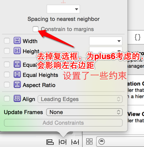

# Autoresizing


Width(中间的横线) 勾选 宽度跟随父控件的宽度等比例伸缩
// (父控件宽度变化多少倍，这个子控件也变多少倍)
height(中间的竖线)

leftMargin (四周的线) // 距离父控件上方的间距是固定的
rightMargin
topMargin
bottomMargin

`总结：`

1.用之前要先取消自动布局

2.周边的线勾上代表固定，里边的线勾上代表伸缩

局限性： 只能解决父子控件之间的相对关系

###提示： `点击控制器会调用touchesBegan:withEvent方法`

```objc
- UIViewAutoresizingFlexible`Left`Margin   = 1 << 0,
    - 距离父控件`左边`的间距是伸缩的
- UIViewAutoresizingFlexible`Right`Margin  = 1 << 2,
    - 距离父控件`右边`的间距是伸缩的
- UIViewAutoresizingFlexible`Top`Margin    = 1 << 3,
    - 距离父控件`上边`的间距是伸缩的
- UIViewAutoresizingFlexible`Bottom`Margin = 1 << 5
    - 距离父控件`下边`的间距是伸缩的
- UIViewAutoresizingFlexible`Width`        = 1 << 1,
    - `宽度`跟随父控件`宽度`进行伸缩
- UIViewAutoresizingFlexible`Height`       = 1 << 4,
注意：跟点击Autoresizing视图设置不一样，值都是伸缩的，所以
距离右边固定 == 距离左边的距离是伸缩的

代码示例：
// 距离四周的距离固定  （高度宽度可伸缩）
self.scrollView.autoresizingMask = UIViewAutoresizingFlexibleWidth | UIViewAutoresizingFlexibleHeight;
// 距离父控件右下角的距离是固定的（高度宽度不变）
self.pageControl.autoresizingMask = UIViewAutoresizingFlexibleLeftMargin | UIViewAutoresizingFlexibleTopMargin;

    - `高度`跟随父控件`高度`进行伸缩
```
# Autorlayout

## 2个核心概念
- 约束
    - 尺寸约束
        - width约束
        - height约束
    - 位置约束
        - 间距约束（上下左右间距）

- 参照
    - 所添加的约束跟哪个控件有关（相对于哪个控件来说）

## 常见单词
- Leading -> Left -> 左边
- Trailing -> Right -> 右边

## UILabel实现包裹内容
- 设置宽度约束为 <= 固定值
- 设置位置约束
- 不用去设置高度约束
## 注意


##补充
- 通过storyboard创建的控件在勾选自动布局时，
在- (void)viewDidLoad 方法中不能 改变控件的frame 在其他方法比如- (void)touchesBegan:withEvent: 可以修改
- 如果去掉storyboard文件自动布局选项,则在- (void)viewDidLoad
中就可以修改控件的frame

`范例`
```objc
    // 添加蓝色控件
    UIView *blueView = [[UIView alloc] init];
    blueView.backgroundColor = [UIColor blueColor];
    [self.view addSubview:blueView];
    #禁止Autoresizing转为Autolayout的约束
    blueView.translatesAutoresizingMaskIntoConstraints = NO;

    // 添加红色控件
    UIView *redView = [[UIView alloc] init];
    redView.backgroundColor = [UIColor redColor];
    // 禁止Autoresizing转为Autolayout的约束
    redView.translatesAutoresizingMaskIntoConstraints = NO;
    [self.view addSubview:redView];

    /*** 添加蓝色控件的约束 ***/
    NSLayoutConstraint *blueLeftLc = [NSLayoutConstraint constraintWithItem:blueView attribute:NSLayoutAttributeLeft relatedBy:NSLayoutRelationEqual toItem:self.view attribute:NSLayoutAttributeLeft multiplier:1.0 constant:20];
    blueLeftLc.priority = 1000; #数值越大，优先级越高
    [self.view addConstraint:blueLeftLc];  // 添加约束

    // 添加自己的约束 nil  NSLayoutAttributeNotAnAttribute
    NSLayoutConstraint *widthLc = [NSLayoutConstraint constraintWithItem:blueView attribute:NSLayoutAttributeWidth relatedBy:NSLayoutRelationEqual toItem:nil attribute:NSLayoutAttributeNotAnAttribute multiplier:0.0 constant:100];

```
