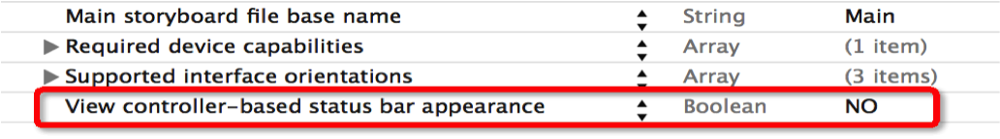

## iOS7中的状态栏
1.从iOS7开始，系统提供了2种管理状态栏的方式
- 通过UIViewController管理（每一个UIViewController都可以拥有自己不同的状态栏）
- 通过UIApplication管理（一个应用程序的状态栏都由它统一管理）

2.在iOS7中，默认情况下，状态栏都是由UIViewController管理的
UIViewController`重写`下列方法就可以轻松管理状态栏的可见性和样式形状
```objc
// 状态栏的风格
-(UIStatusBarStyle)preferredStatusBarStyle
{
    return UIStatusBarStyleDefault; // 黑色字体
    //return UIStatusBarStyleLightContent; // 白色字体
}

// 通过控制器隐藏状态栏
-(BOOL)prefersStatusBarHidden;
{
    return YES; //隐藏
}
```
3.利用UIApplication来管理状态栏

如果想利用UIApplication来管理状态栏，首先得修改Info.plist的设置



```objc
UIApplication *app =  [UIApplication sharedApplication];
// UIApplication对象设置状态栏的隐藏和风格
[app setStatusBarHidden:(BOOL)];
[app setStatusBarHidden:(BOOL)] withAnimation:(UIStatusBarAnimation)];
[app setStatusBarStyle:(UIStatusBarStyle)];
[app setStatusBarStyle:(UIStatusBarStyle) animated:(BOOL)];
```
