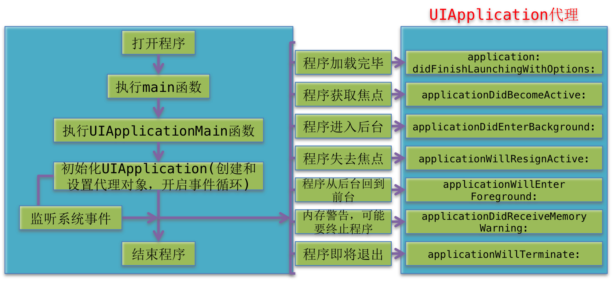
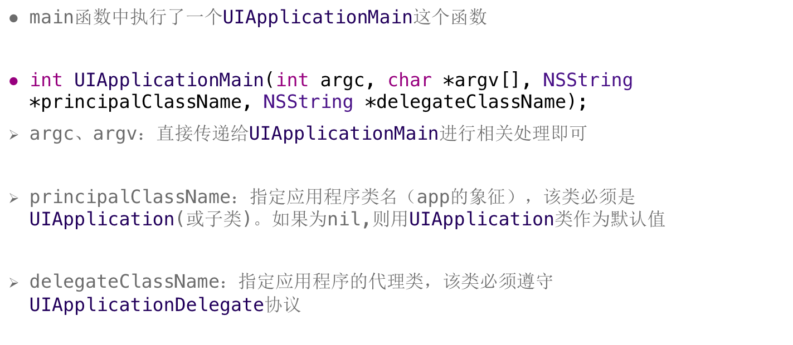
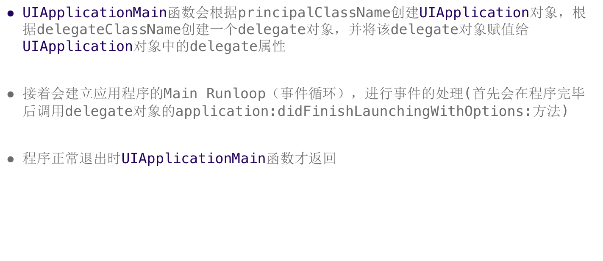
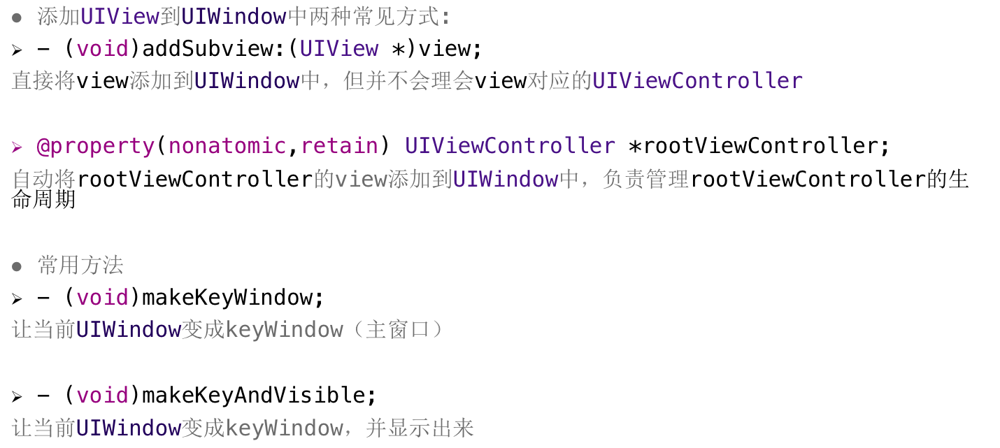
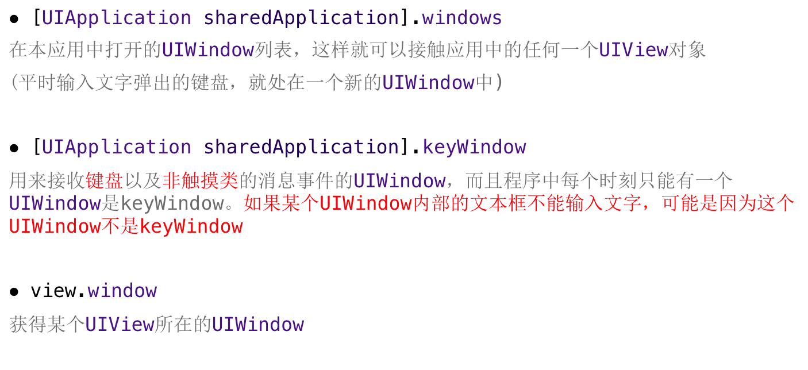
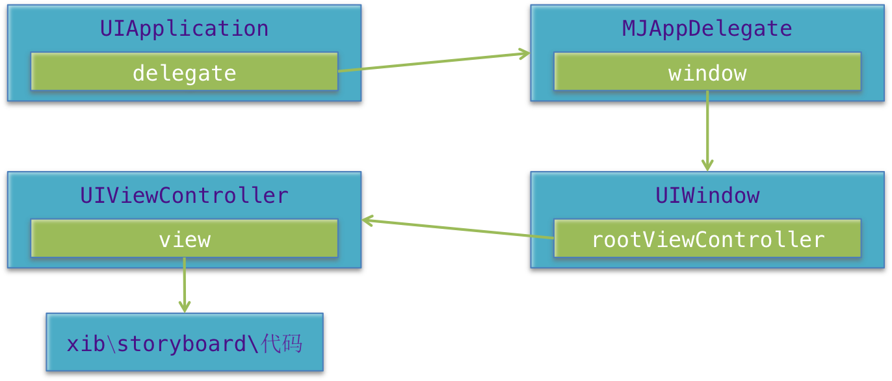

##一、IOS启动过程

#### 1. UIApplicationMain


#### 2. UIWindow
<1> UIWindow是一种特殊的UIView，通常在一个app中只会有一个UIWindow

<2>iOS程序启动完毕后，创建的第一个视图控件就是UIWindow，接着创建控制器的view，最后将控制器的view添加到UIWindow上，于是控制器的view就显示在屏幕上了

<3>一个iOS程序之所以能显示到屏幕上，完全是因为它有UIWindow
    也就说，没有UIWindow，就看不见任何UI界面

1.UIWindow的获得

```objc

// 1.创建窗口
// 2.加载Main.storyboard，并且创建storyboard描述的控制器
// 3.把storyboard描述的控制器作为窗口的根控制器
// 4.显示窗口

//注意：窗口要显示出来必须的步骤 1.强引用窗口 2.设置窗口的尺寸
// 在程序启动完成的时候，仅仅只是帮你创建好窗口，并不会马上显示。

// @implementation AppDelegate 中

- (BOOL)application:(UIApplication *)application didFinishLaunchingWithOptions:(NSDictionary *)launchOptions {

//    NSLog(@"%@",self.window);
    NSLog(@"%@",application.keyWindow);
    [self windowLevel];
    return YES;
}
- (void)windowLevel // 自定义
{

    self.window = [[UIWindow alloc] initWithFrame:[UIScreen mainScreen].bounds];
    //    self.window.alpha = 0.6;
    // 设置窗口的层级 UIWindowLevelAlert UIWindowLevelNormal UIWindowLevelStatusBar
    // UIWindowLevelAlert > UIWindowLevelStatusBar > UIWindowLevelNormal
    //    self.window.windowLevel = UIWindowLevelStatusBar + 1;

    NSLog(@"%f",UIWindowLevelAlert);
    self.window.backgroundColor = [UIColor yellowColor];

    // 状态栏是一个窗口，键盘也是一个窗口
    // application.windows:可以利用这个属性，学习下当前API哪些控件是窗口


    // 弹出键盘,UITextField就是用来弹出键盘，不需要展示
    // 注意，如果想通过textField弹出键盘，必须要把textField添加到某个控件上
    //    UITextField *textField = [[UITextField alloc] init];
    //    [textField becomeFirstResponder];
    //    [self.window addSubview:textField];

    // 让窗口显示,让窗口成为我们应用程序的主窗口
    [self.window makeKeyAndVisible];
    // 1.让窗口成为应用程序的主窗口 2.设置窗口不要给隐藏
    //    1. application.keyWindow = self.window
    //    2. self.window.hidden = NO;

    // 创建第二个窗口
    self.window1 = [[UIWindow alloc] initWithFrame:CGRectMake(50, 400, 300, 300)];

    self.window1.backgroundColor = [UIColor redColor];

    self.window1.windowLevel = UIWindowLevelStatusBar;
    NSLog(@"%f",self.window1.windowLevel);

    self.window1.hidden = NO;

    //    NSLog(@"%@",application.windows);

}

- (void)setWindow  //自定义
{
    // 1.创建窗口
    self.window = [[UIWindow alloc] initWithFrame:[UIScreen mainScreen].bounds];

    self.window.backgroundColor = [UIColor redColor];

    // 2.创建窗口的根控制器
    UIViewController *rootVc = [[UIViewController alloc] init];
    rootVc.view.backgroundColor = [UIColor greenColor];

    //    UIButton *addBtn = [UIButton buttonWithType:UIButtonTypeContactAdd];
    //    addBtn.center = CGPointMake(200, 200);
    //    [rootVc.view addSubview:addBtn];
    //    [self.window addSubview:rootVc.view];

    // 把控制器作为窗口的跟控制器，就会把跟控制器的view自动添加到窗口
    // 设置了窗口的根控制器，有旋转的功能
    self.window.rootViewController = rootVc;

    // 3.显示窗口
    [self.window makeKeyAndVisible];

}
```
#### 3.四大对象关系图


