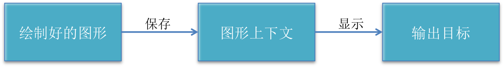

# Quartz2D

###1. 掌握

- drawRect:方法的使用

- 常见图形的绘制：线条、多边形、圆

- 绘图状态的设置：文字颜色、线宽等

- 图形上下文状态的保存与恢复（图形上下文栈）

- 图片裁剪

- 截图

###2. Quartz 2D介绍

Quartz 2D是一个二维绘图引擎，同时支持iOS和Mac系统

Quartz 2D能完成的工作

- 绘制图形 : 线条\三角形\矩形\圆\弧等

- 绘制文字

- 绘制\生成图片(图像)

- 读取\生成PDF

- 截图\裁剪图片

- 自定义UI控件
- … …

###3. 图形上下文

图形上下文（Graphics Context）是一个CGContextRef类型的数据

图形上下文的作用
保存绘图信息、绘图状态
决定绘制的输出目标（绘制到什么地方去？）
（输出目标可以是PDF文件、Bitmap或者显示器的窗口上）


相同的一套绘图序列，指定不同的Graphics Context，就可将相同的图像绘制到不同的目标上

Quartz2D提供了以下几种类型的Graphics Context：
- Bitmap Graphics Context
- PDF Graphics Context
- Window Graphics Context
- Layer Graphics Context
- Printer Graphics Context

###4. 自定义view
如何利用Quartz2D自定义view？（自定义UI控件）

如何利用Quartz2D绘制东西到view上？
首先，得有图形上下文，因为它能保存绘图信息，并且决定着绘制到什么地方去
其次，那个图形上下文必须跟view相关联，才能将内容绘制到view上面

自定义view的步骤
- 新建一个类，继承自UIView
- 实现- (void)drawRect:(CGRect)rect方法，然后在这个方法中
取得跟当前view相关联的图形上下文
- 绘制相应的图形内容
- 利用图形上下文将绘制的所有内容渲染显示到view上面

###5. drawRect:

1. 为什么要实现drawRect:方法才能绘图到view上？

    因为在drawRect:方法中才能取得跟view相关联的图形上下文

2. drawRect:方法在什么时候被调用？

    当view第一次显示到屏幕上时（被加到UIWindow上显示出来）
    调用view的setNeedsDisplay或者setNeedsDisplayInRect:时

    调用顺序
    ```objc
     -[ViewController viewDidLoad]
     -[ViewController viewWillAppear:]
     -[ShapeView drawRect:]
     -[ViewController viewDidAppear:]
    ```
3. drawRect:中取得的上下文

    -  在drawRect:方法中取得上下文后，就可以绘制东西到view上
    - View内部有个layer（图层）属性，drawRect:方法中取得的是一个Layer Graphics Context，因此，绘制的东西其实是绘 制到view的layer上去了

    - View之所以能显示东西，完全是因为它内部的layer

    - 不管以后是否需要上下文，只要绘制东西，都要在drawRect方法写，才能显示到view

    - setNeedsDisplay底层会调用drawRect重绘,但不是马上。
 注意：调用setNeedsDisplay并不会马上触发drawRect方法，仅仅是给当前这个view设置一个重新绘制的标志，等下一次屏幕刷新的时候才会去调用drawRect

    -  1.获取上下文 2.拼接路径 3.把路径添加到上下文 4.渲染上下文

###6. Quartz2D须知

- Quartz2D的API是纯C语言的

- Quartz2D的API来自于Core Graphics框架,数据类型和函数基本都以CG作为前缀
- CGContextRef
- CGPathRef
- CGContextStrokePath(ctx);
- ……

###7. Quartz2D绘图的代码步骤
1. 获得图形上下文
```objc
CGContextRef ctx = UIGraphicsGetCurrentContext();
```
2. 拼接路径（下面代码是搞一条线段）
```objc
CGContextMoveToPoint(ctx, 10, 10);
CGContextAddLineToPoint(ctx, 100, 100);
```
3. 绘制路径
```objc
CGContextStrokePath(ctx); // CGContextFillPath(ctx);
```
###8. 常用拼接路径函数

```objc
新建一个起点
void CGContextMoveToPoint(CGContextRef c, CGFloat x, CGFloat y)

添加新的线段到某个点
void CGContextAddLineToPoint(CGContextRef c, CGFloat x, CGFloat y)

添加一个矩形
void CGContextAddRect(CGContextRef c, CGRect rect)

添加一个椭圆
void CGContextAddEllipseInRect(CGContextRef context, CGRect rect)

添加一个圆弧
void CGContextAddArc(CGContextRef c, CGFloat x, CGFloat y,
  CGFloat radius, CGFloat startAngle, CGFloat endAngle, int clockwise)
```
###9. 常用绘制路径函数

```objc
Mode参数决定绘制的模式
void CGContextDrawPath(CGContextRef c, CGPathDrawingMode mode)

绘制空心路径
void CGContextStrokePath(CGContextRef c)

绘制实心路径
void CGContextFillPath(CGContextRef c)

 提示：一般以CGContextDraw、CGContextStroke、CGContextFill开头的函数，都是用来绘制路径的
```
###10. 图形上下文栈的操作

```objc
将当前的上下文copy一份,保存到栈顶(那个栈叫做”图形上下文栈”)
void CGContextSaveGState(CGContextRef c)

将栈顶的上下文出栈,替换掉当前的上下文
void CGContextRestoreGState(CGContextRef c)

```
###11. 矩阵操作

```objc
利用矩阵操作，能让绘制到上下文中的所有路径一起发生变化缩放
void CGContextScaleCTM(CGContextRef c, CGFloat sx, CGFloat sy)

旋转
void CGContextRotateCTM(CGContextRef c, CGFloat angle)

平移
void CGContextTranslateCTM(CGContextRef c, CGFloat tx, CGFloat ty)
```
###12. 图片水印

实现方式：利用Quartz2D，将水印(文字、LOG)画到图片的右下角

核心代码:
```objc
开启一个基于位图的图形上下文
void     UIGraphicsBeginImageContextWithOptions(CGSize size, BOOL opaque, CGFloat scale)

从上下文中取得图片（UIImage）
UIImage* UIGraphicsGetImageFromCurrentImageContext();

结束基于位图的图形上下文
void     UIGraphicsEndImageContext();
```
###13. 图片剪裁
核心代码
```objc
void CGContextClip(CGContextRef c)
将当前上下所绘制的路径裁剪出来（超出这个裁剪区域的都不能显示）
```

###14. 屏幕截图
核心代码
```objc
- (void)renderInContext:(CGContextRef)ctx;
调用某个view的layer的renderInContext:方法即可
```

##范例

####1. 画线

```objc
- (void)drawRect:(CGRect)rect {
    // 一个路径对象，可以对应多跟线

    // 1.获取跟当前view想关联的上下文,系统自动帮我们创建的上下文
    CGContextRef ctx = UIGraphicsGetCurrentContext();

    // 设置上下文的状态,应该放在渲染之前就可以
    // 创建对应颜色对象，调用set方法
    [[UIColor redColor] set];

    // 设置上下文的线宽
    CGContextSetLineWidth(ctx, 15);

    // 设置线段的连接样式
    CGContextSetLineJoin(ctx, kCGLineJoinRound);
    // 设置线段两端的样式
    CGContextSetLineCap(ctx, kCGLineCapRound);

    // 2.拼接路径，UIBezierPath,封装好了一套很好使用的路径
    // UIKit
    UIBezierPath *path = [UIBezierPath bezierPath];

    // 2.1 设置起点
    [path moveToPoint:CGPointMake(10, 125)];

    // 2.2 添加一根线到某个点
    [path addLineToPoint:CGPointMake(220, 125)];

    // 如果只使用一根路径，默认下一根线的起点在上一根跟线终点
    [path addLineToPoint:CGPointMake(200, 150)];

    // 3.添加路径到上下文
    // CGPathRef CoreGraphics UIKit path ->  CoreGraphics path
    CGContextAddPath(ctx, path.CGPath);

    // 4.渲染到view上面的图层

    CGContextStrokePath(ctx);
}
```
####2. 曲线

```objc
- (void)drawRect:(CGRect)rect {
    // 1.获取上下文
    CGContextRef ctx = UIGraphicsGetCurrentContext();
    // 2.拼接路径
    UIBezierPath *path = [UIBezierPath bezierPath];
        // 2.1  起点
    [path moveToPoint:CGPointMake(10, 125)];
        // 2.2  曲线 设置终点和控制点
    [path addQuadCurveToPoint:CGPointMake(240, 125) controlPoint:CGPointMake(125, 0)];

    // 3.路径添加到上下文
    CGContextAddPath(ctx, path.CGPath);

    // 4.渲染上下文
        // 4.1填充并会关闭路径，从路径的终点到起点
        //CGContextFillPath(ctx);
        // 4.2 画线
        CGContextStrokePath(ctx);
}
```
####3. 画圆
```objc
- (void)drawRect:(CGRect)rect {
    /*
     画圆弧
     center：圆心
     radius：半径
     clockwise：当前是 yes：顺时针 no：逆时针
     */

    // 1/4圆弧 M_PI =  ∏
    UIBezierPath *path = [UIBezierPath bezierPathWithArcCenter:CGPointMake(125, 125) radius:100 startAngle:0 endAngle:-M_PI_2  clockwise:NO];

    // 添加一根线到圆心
//    [path addLineToPoint:center];

    // 关闭路径：从路径的终点到起点
//    [path closePath];

    // 下面两个方法是关于图形上下文的操作，调用一个才显示
    // 1.描边
    [path stroke];
    // 2.填充，默认会关闭路径，从路径的终点到起点
//    [path fill];
}
```
###4.绘制矩形

```objc
- (void)drawRect:(CGRect)rect {
    CGContextRef ctx = UIGraphicsGetCurrentContext();

    UIBezierPath *path = [UIBezierPath bezierPathWithRoundedRect:CGRectMake(50, 50, 150, 100) cornerRadius:10];

    CGContextAddPath(ctx, path.CGPath);

    // 设置填充的颜色
    [[UIColor redColor] setFill];

    // 设置描边的颜色 需要修改渲染模式包含有 描边
    [[UIColor greenColor] setStroke];

    // 填充：必须封闭的路径
    // 即描边又填充
    // 如果以后只需要描边，最好不要使用fill
    CGContextDrawPath(ctx, kCGPathFillStroke);// 填充+描边
    //    CGContextFillPath(ctx); //填充
    //    CGContextStrokePath(ctx);// 描边
}
```
###5. 上下文矩阵操作(形变)

```objc
- (void)drawRect:(CGRect)rect {

    // 获取上下文
   CGContextRef ctx =  UIGraphicsGetCurrentContext();

    UIRectFill(CGRectMake(-100, -50, 200, 100));

    // 拼接路径
    UIBezierPath *path = [UIBezierPath bezierPathWithOvalInRect:CGRectMake(-100, -50, 200, 100)];

    // 矩阵操作：必须要在添加路径之前进行形变
    // 平移上下文
    CGContextTranslateCTM(ctx, 100, 100);

    // 旋转
    CGContextRotateCTM(ctx, M_PI_4);

    // 缩放
    CGContextScaleCTM(ctx, 0.5, 0.5);

    // 添加路径到上下文
    CGContextAddPath(ctx, path.CGPath);

    // 渲染上下文
    CGContextFillPath(ctx);
}
```
###6. 图片水印
```objc
  - (void)viewDidLoad {
    [super viewDidLoad];
    // 图片水印 -> 生成一张新的带有logo,文字的图片
    // 生成图片 -> 位图上下文
    UIImage *image = [UIImage imageNamed:@"小黄人"];

    // 创建位图上下文
    // size:上下文尺寸
    // opaque:不透明 Yes 不透明 透明 NO
    // scale：是否缩放上下文，0表示不要缩放
    UIGraphicsBeginImageContextWithOptions(image.size, NO, 0);

    [image drawAtPoint:CGPointZero];

    // 文字
    NSString *str = @"小码哥";

    [str drawAtPoint:CGPointMake(0, 0) withAttributes:nil];

    // 根据上下文的内容生成一张图片

    image = UIGraphicsGetImageFromCurrentImageContext();

    // 关闭上下文
    UIGraphicsEndImageContext();
}
```
###7. 在绘图中不会使用NSTimer
`一般在初始化时生成定时器`
```objc
- (void)awakeFromNib
{
    //    [NSTimer scheduledTimerWithTimeInterval:0.01 target:self selector:@selector(setNeedsDisplay) userInfo:nil repeats:YES];

    // 0.01 触发timer 0.02 0.024 0.004

    // 每次屏幕刷新的时候就会触发，通常我们的屏幕一秒刷新60次，
    // 1秒调用60次
    CADisplayLink *link = [CADisplayLink displayLinkWithTarget:self selector:@selector(setNeedsDisplay)];

    [link addToRunLoop:[NSRunLoop mainRunLoop] forMode:NSDefaultRunLoopMode];

    // setNeedsDisplay: 底层会调用drawRect重绘，但不是马上。
    // 注意：调用setNeedsDisplay并不会马上触发drawRect方法，仅仅是给当前这个view设置一个重新绘制的标志，等下一次屏幕刷新的时候才会去调用drawRect
}
```
###8.  画文字

```objc
- (void)drawRect:(CGRect)rect {
    NSString *str = @"小码哥";
    // 描述文字的属性，颜色，字体大小
    NSMutableDictionary *attr = [NSMutableDictionary dictionary];
    // 字体
    attr[NSFontAttributeName] = [UIFont systemFontOfSize:50];
    // 颜色
    attr[NSForegroundColorAttributeName] = [UIColor redColor];

    // 边框颜色
    attr[NSStrokeColorAttributeName] = [UIColor redColor];
    // 边框宽度
    attr[NSStrokeWidthAttributeName] = @1;

    NSShadow *shadow = [[NSShadow alloc] init];
    shadow.shadowOffset = CGSizeMake(3, 3);
    shadow.shadowColor = [UIColor yellowColor];
    shadow.shadowBlurRadius = 3;
    // 阴影
    attr[NSShadowAttributeName] = shadow;

    // Attributes:给文字添加一些属性，富文本
    // 字典：描述文字的属性

    // 不能自动换行
    [str drawAtPoint:CGPointZero withAttributes:attr];
    // 会自动换行
    //    [str drawInRect:rect withAttributes:attr];
}
```
###9. 常用方法
```objc
- (void)drawRect:(CGRect)rect {
    CGContextRef ctx =  UIGraphicsGetCurrentContext();
    UIGraphicsPushContext(ctx);
    UIGraphicsPopContext();

    // 设置颜色
    [[UIColor blackColor] set];  // fill and Stroke
    [[UIColor blueColor] setFill]; // Fill
    [[UIColor blueColor] setStroke];// Stroke

    // 设置线宽
    CGContextSetLineWidth(ctx, 10);

    // 拼接路径
    UIBezierPath *path = [UIBezierPath bezierPath];
    // 1.圆弧
    path = [UIBezierPath bezierPathWithArcCenter:(CGPoint) radius:(CGFloat) startAngle:(CGFloat) endAngle:(CGFloat) clockwise:(BOOL)];
    // 2. 圆
    path = [UIBezierPath bezierPathWithOvalInRect:(CGRect)];
    // 3. 圆角矩形
    path = [UIBezierPath bezierPathWithRoundedRect:(CGRect) cornerRadius:(CGFloat)];
    // 4. 矩形
    path = [UIBezierPath bezierPathWithRect:(CGRect)];


    UIImage *image = [UIImage imageNamed:@"阿狸头像"];
    // 绘制出来的图形跟图片一样大
    [image drawAtPoint:CGPointZero];
    [image drawInRect:rect];
    [image drawAsPatternInRect:rect];

    // 要超出裁剪区域的部分，都会被裁剪掉，必须先设置裁剪区域
    UIRectClip(CGRectMake(0, 0, 50, 50));
    // 擦除上下文的内容
    CGContextClearRect(CGContextRef c, CGRect rect);

    // 填充
    UIRectFill(rect);
}
```

```objc
//
//  DrawView.m
//  07-UIKit绘图演练

#import "DrawView.h"

@implementation DrawView


// Only override drawRect: if you perform custom drawing.
// An empty implementation adversely affects performance during animation.


// 1.获取上下文 2.拼接路径 3.把路径添加到上下文 4.渲染上下文

- (void)drawRect:(CGRect)rect {


    CGContextRef ctx =  UIGraphicsGetCurrentContext();
    UIGraphicsPushContext(ctx);
    UIGraphicsPopContext();

    // 设置颜色
    [[UIColor blackColor] set];  // fill and Stroke
    [[UIColor blueColor] setFill]; // Fill
    [[UIColor blueColor] setStroke];// Stroke

    // 设置线宽
    CGContextSetLineWidth(ctx, 10);

    // 拼接路径
    UIBezierPath *path = [UIBezierPath bezierPath];
    // 1.圆弧
    path = [UIBezierPath bezierPathWithArcCenter:(CGPoint) radius:(CGFloat) startAngle:(CGFloat) endAngle:(CGFloat) clockwise:(BOOL)];
    // 2. 圆
    path = [UIBezierPath bezierPathWithOvalInRect:(CGRect)];
    // 3. 圆角矩形
    path = [UIBezierPath bezierPathWithRoundedRect:(CGRect) cornerRadius:(CGFloat)];
    // 4. 矩形
    path = [UIBezierPath bezierPathWithRect:(CGRect)];


    UIImage *image = [UIImage imageNamed:@"阿狸头像"];
    // 绘制出来的图形跟图片一样大
    [image drawAtPoint:CGPointZero];
    [image drawInRect:rect];
    [image drawAsPatternInRect:rect];

    // 要超出裁剪区域的部分，都会被裁剪掉，必须先设置裁剪区域
    UIRectClip(CGRectMake(0, 0, 50, 50));

    // 填充
    UIRectFill(rect);

}

// 在绘图中不会使用NSTimer
- (void)awakeFromNib
{
    //    [NSTimer scheduledTimerWithTimeInterval:0.01 target:self selector:@selector(setNeedsDisplay) userInfo:nil repeats:YES];

    // 0.01 触发timer 0.02 0.024 0.004

    // 每次屏幕刷新的时候就会触发，通常我们的屏幕一秒刷新60次，
    // 1秒调用60次
    CADisplayLink *link = [CADisplayLink displayLinkWithTarget:self selector:@selector(setNeedsDisplay)];

    [link addToRunLoop:[NSRunLoop mainRunLoop] forMode:NSDefaultRunLoopMode];

    // setNeedsDisplay: 底层会调用drawRect重绘，但不是马上。
    // 注意：调用setNeedsDisplay并不会马上触发drawRect方法，仅仅是给当前这个view设置一个重新绘制的标志，等下一次屏幕刷新的时候才会去调用drawRect
}

// 画文字
- (void)drawText
{
    NSString *str = @"小码哥";

    // 描述文字的属性，颜色，字体大小
    NSMutableDictionary *attr = [NSMutableDictionary dictionary];
    // 字体
    attr[NSFontAttributeName] = [UIFont systemFontOfSize:50];
    // 颜色
    attr[NSForegroundColorAttributeName] = [UIColor redColor];

    // 边框颜色
    attr[NSStrokeColorAttributeName] = [UIColor redColor];
    // 边框宽度
    attr[NSStrokeWidthAttributeName] = @1;

    NSShadow *shadow = [[NSShadow alloc] init];
    shadow.shadowOffset = CGSizeMake(3, 3);
    shadow.shadowColor = [UIColor yellowColor];
    shadow.shadowBlurRadius = 3;

    // 阴影
    attr[NSShadowAttributeName] = shadow;

    // Attributes:给文字添加一些属性，富文本
    // 字典：描述文字的属性

    // 不能自动换行
    [str drawAtPoint:CGPointZero withAttributes:attr];
    // 会自动换行
    //    [str drawInRect:rect withAttributes:attr];
}
@end

```
###补充笔记
```objc
// 图层3D旋转效果
_imageView.layer.transform = CATransform3DMakeRotation(M_PI, 0, 1, 0);

// KVC
// 结构体CATransform3D转换对象
NSValue *value = [NSValue valueWithCATransform3D:CATransform3DMakeRotation(M_PI, 0, 1, 0)];


// 隐式动画
// _layer.bounds = CGRectMake(0, 0, arc4random_uniform(150), arc4random_uniform(150));
// 动画都是包装到一个事务
// 开启事务
[CATransaction begin];
// 不需要隐式动画
// [CATransaction setDisableActions:YES];

[CATransaction setAnimationDuration:2];
// 提交事务
[CATransaction commit];

阴影层 要设置frame 不然看不见啊
CG开头的声明结构体,不加 *
CA开头的除了CATransform3D不加 * 其余要加;
核心动画都是假象，不改变图层原来的frame

给View添加拖拽手势的时候，拖拽view,如果修改transform属性，并不会改变center bounds，底层会改变frame的origin.

CATransform3DMakeRotation
CATransform3DRotation 多了一个transform参数 可以先创建修改其他参数，再传进来

对本身做形变处理 修改自己的锚点
复制层对复制出来的图层做形变()，复制层修改自己的锚点
Translate 对于上个layer 每个点的坐标变化x-y-z(左负右正)
Rotate 相对于上个layer 绕着以父层的锚点为原点建立坐标系，以传入的x-y-z为终点的方向向量旋转
Scale 相对于上个layer的 每个点的坐标都缩小为原来的x-y-z倍（可以定位中心点，长宽高缩小x-y-z倍）
position与anchorPoint在同一点 position相对于superLayer, anchorPoint相对于layer本身范围(0-1,0-1);


如何增加立体感，近大远小
// 400.0 可以理解为，人的眼睛离手机屏幕的垂直距离，越小，近大远小效果越明显
transform.m34 = -1 / 400.0;

[path removeAllPoints]; // 删除路径上所有点
[layer removeAllAnimations]; // 移除图层上所有动画

// 添加一个小圆, 默认跟大圆一样，有几个相同的属性，frame,y圆角半径，背景色
// copy:有相同属性的新对象
// copy底层其实是调用copyWithZone:
UIView *smallCircleView = [self copy]; // copy是NSObject对象的

```


