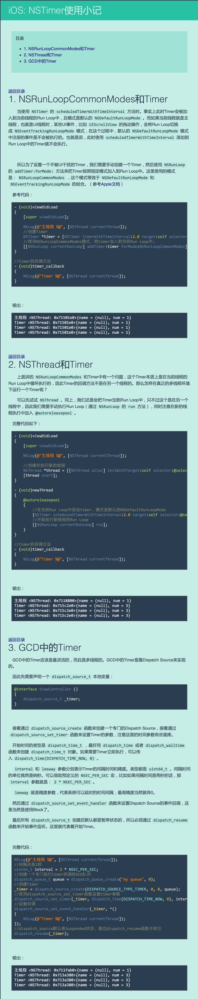

## NSTimer的使用
- 开启定时器

```objc
@property (nonatomic, weak) NSTimer *timer;

// 返回一个自动开始执行任务的定时器
self.timer = [NSTimer scheduledTimerWithTimeInterval:2.0 target:self selector:@selector(nextPage:) userInfo:@"123" repeats:YES];

// 修改NSTimer在NSRunLoop中的模式：NS**RunLoopCommonModes
// 主线程不管在处理什么操作，都会抽时间处理NSTimer
[[NSRunLoop mainRunLoop] addTimer:self.timer forMode:NSDefaultRunLoopMode];
```
- NSRunLoopCommonModes模式包含NSDefaultRunLoopMode
- NSRunLoopCommonModes可以在处理拖拽事件时依然让定时器计数
- 关闭定时器

```objc
// 移除定时器
[self.timer invalidate];
// 要清空
self.timer = nil;
```
 - ####定时器声明为局部变量也会一直执行,为了停止定时器,通常会定义weak属性引用定时器对象



