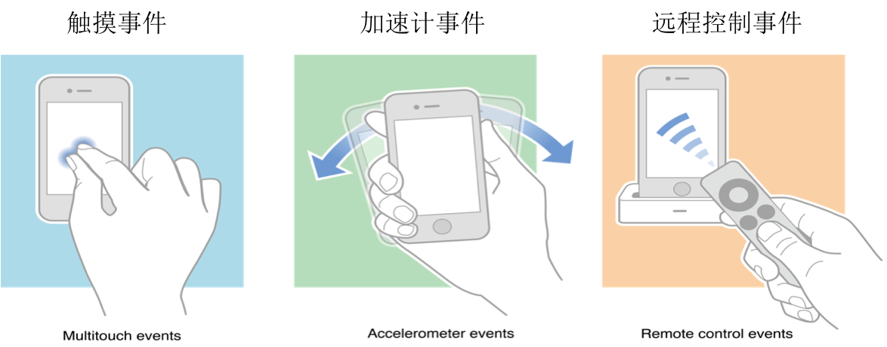
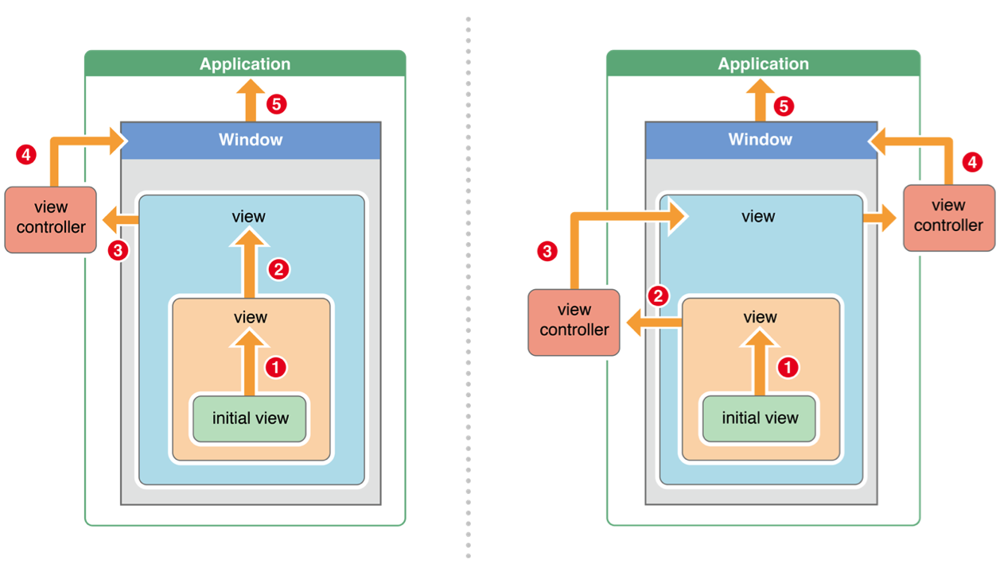

# 触摸事件
##1. iOS中的事件

iOS中的事件可以分为3大类型

##2. 响应者对象
<1>在iOS中不是任何对象都能处理事件，只有继承了UIResponder的对象才能接收并处理事件。我们称之为“响应者对象”

<2>UIApplication、UIViewController、UIView都继承自UIResponder，因此它们都是响应者对象，都能够接收并处理事件

##3.UIResponder

<1> UIResponder内部提供了以下方法来处理事件
```objc
触摸事件
- (void)touchesBegan:(NSSet *)touches withEvent:(UIEvent *)event;
- (void)touchesMoved:(NSSet *)touches withEvent:(UIEvent *)event;
- (void)touchesEnded:(NSSet *)touches withEvent:(UIEvent *)event;
- (void)touchesCancelled:(NSSet *)touches withEvent:(UIEvent *)event;

加速计事件
- (void)motionBegan:(UIEventSubtype)motion withEvent:(UIEvent *)event;
- (void)motionEnded:(UIEventSubtype)motion withEvent:(UIEvent *)event;
- (void)motionCancelled:(UIEventSubtype)motion withEvent:(UIEvent *)event;

远程控制事件
- (void)remoteControlReceivedWithEvent:(UIEvent *)event;

```
##4. UIView的触摸事件处理
```objc
UIView是UIResponder的子类，可以覆盖下列4个方法处理不同的触摸事件
一根或者多根手指开始触摸view，系统会自动调用view的下面方法
- (void)touchesBegan:(NSSet *)touches withEvent:(UIEvent *)event

一根或者多根手指在view上移动，系统会自动调用view的下面方法（随着手指的移动，会持续调用该方法）
- (void)touchesMoved:(NSSet *)touches withEvent:(UIEvent *)event

一根或者多根手指离开view，系统会自动调用view的下面方法
- (void)touchesEnded:(NSSet *)touches withEvent:(UIEvent *)event

触摸结束前，某个系统事件(例如电话呼入)会打断触摸过程，系统会自动调用view的下面方法
- (void)touchesCancelled:(NSSet *)touches withEvent:(UIEvent *)event
提示：touches中存放的都是UITouch对象
```

##5.UITouch

<1> UITouch的说明

1. 当用户用一根手指触摸屏幕时，会创建一个与手指相关联的UITouch对象

2. 一根手指对应一个UITouch对象

3.  UITouch的作用:保存着跟手指相关的信息，比如触摸的位置、时间、阶段

4. 当手指移动时，系统会更新同一个UITouch对象，使之能够一直保存该手指在的触摸位置

5. 当手指离开屏幕时，系统会销毁相应的UITouch对象

6. 提示：iPhone开发中，要避免使用双击事件！

<2>UITouch的属性

```objc
触摸产生时所处的窗口
@property(nonatomic,readonly,retain) UIWindow    *window;

触摸产生时所处的视图
@property(nonatomic,readonly,retain) UIView      *view;

短时间内点按屏幕的次数，可以根据tapCount判断单击、双击或更多的点击
@property(nonatomic,readonly) NSUInteger          tapCount;

记录了触摸事件产生或变化时的时间，单位是秒
@property(nonatomic,readonly) NSTimeInterval      timestamp;

当前触摸事件所处的状态
@property(nonatomic,readonly) UITouchPhase        phase;

```
<3>UITouch的方法
```objc
- (CGPoint)locationInView:(UIView *)view;
返回值表示触摸在view上的位置
这里返回的位置是针对view的坐标系的（以view的左上角为原点(0, 0)）
调用时传入的view参数为nil的话，返回的是触摸点在UIWindow的位置

- (CGPoint)previousLocationInView:(UIView *)view;
该方法记录了前一个触摸点的位置
```
##6.UIEvent
<1>每产生一个事件，就会产生一个UIEvent对象

<2>UIEvent：称为事件对象，记录事件产生的时刻和类型

`常见属性`

事件类型
```objc
@property(nonatomic,readonly) UIEventType     type;
@property(nonatomic,readonly) UIEventSubtype  subtype;
```
事件产生的时间
```objc
@property(nonatomic,readonly) NSTimeInterval  timestamp;
```
<3>UIEvent还提供了相应的方法可以获得在某个view上面的触摸对象（UITouch）
<4>touches和event参数
```objc
一次完整的触摸过程，会经历3个状态：
触摸开始：- (void)touchesBegan:(NSSet *)touches withEvent:(UIEvent *)event
触摸移动：- (void)touchesMoved:(NSSet *)touches withEvent:(UIEvent *)event
触摸结束：- (void)touchesEnded:(NSSet *)touches withEvent:(UIEvent *)event
触摸取消（可能会经历）：- (void)touchesCancelled:(NSSet *)touches withEvent:(UIEvent *)event
```
<5>4个触摸事件处理方法中，都有NSSet *touches和UIEvent *event两个参数
- 一次完整的触摸过程中，只会产生一个事件对象，4个触摸方法都是同一个event参数
如果两根手指同时触摸一个view，那么view只会调用一次touchesBegan:withEvent:方法，touches参数中装着2个UITouch对象.
- 如果这两根手指一前一后分开触摸同一个view，那么view会分别调用2次touchesBegan:withEvent:方法，并且每次调用时的touches参数中只包含一个UITouch对象

- 根据touches中UITouch的个数可以判断出是单点触摸还是多点触摸
##7.事件的产生和传递

<1> 发生触摸事件后，系统会将该事件加入到一个由UIApplication管理的事件队列中

<2>  UIApplication会从事件队列中取出最前面的事件，并将事件分发下去以便处理，通常，先发送事件给应用程序的主窗口（keyWindow）

<3> 主窗口会在视图层次结构中找到一个最合适的视图来处理触摸事件，这也是整个事件处理过程的第一步

<4>找到合适的视图控件后，就会调用视图控件的touches方法来作具体的事件处理
- touchesBegan…
- touchesMoved…
- touchedEnded…

<5> 如果父控件不能接收触摸事件，那么子控件就不可能接收到触摸事件(掌握)

##8.UIView不接收触摸事件的三种情况
1.不接收用户交互
userInteractionEnabled = NO

2.隐藏
hidden = YES

3.透明
alpha = 0.0 ~ 0.01

`提示：UIImageView的userInteractionEnabled默认就是NO，因此UIImageView以及它的子控件默认是不能接收触摸事件的`

##9.触摸事件处理的详细过程
1.用户点击屏幕后产生的一个触摸事件，经过一系列的传递过程后，会找到最合适的视图控件来处理这个事件

 2.找到最合适的视图控件后，就会调用控件的touches方法来作具体的事件处理
touchesBegan…
touchesMoved…
touchedEnded…

 3.这些touches方法的`默认做法`是将事件`顺着响应者链条`向上传递，将事件交给上一个响应者进行处理

##10.响应者链条示意图
- 响应者链条：是由多个响应者对象连接起来的链条
- 作用：能很清楚的看见每个响应者之间的联系，并且可以让一个事件多个对象处理。
- 响应者对象：能处理事件的对象


##11.事件传递的完整过程

1> 先将事件对象由上往下传递(由父控件传递给子控件)，找到最合  适的控件来处理这个事件。

2> 调用最合适控件的touches….方法

3> 如果调用了[super touches….];就会将事件顺着响应者链条 往上传递，传递给上一个响应者

4> 接着就会调用上一个响应者的touches….方法

`如何判断上一个响应者`

1> 如果当前这个view是控制器的view,那么控制器就是上一个响应者


2> 如果当前这个view不是控制器的view,那么父控件就是上一个响应者
##12.响应者链的事件传递过程
1.如果view的控制器存在，就传递给控制器；如果控制器不存在，则将其传递给它的父视图

2.在视图层次结构的最顶级视图，如果也不能处理收到的事件或消息，则其将事件或消息传递给window对象进行处理

3.如果window对象也不处理，则其将事件或消息传递给UIApplication对象

4.如果UIApplication也不能处理该事件或消息，则将其丢弃

##13.监听触摸事件的做法
1.如果想监听一个view上面的触摸事件，之前的做法是
<1>自定义一个view
<2>实现view的touches方法，在方法内部实现具体处理代码

2.通过touches方法监听view触摸事件，有很明显的几个缺点
<1>必须得自定义view
<2>由于是在view内部的touches方法中监听触摸事件，因此默认情况下，无法让其他外界对象监听view的触摸事件
<3>不容易区分用户的具体手势行为

3.iOS 3.2之后，苹果推出了手势识别功能（Gesture Recognizer) 在触摸事件处理方面，大大简化了开发者的开发难度

#备注

面试 : UIEvent
```
当修改父控件的透明度alpha,会影响子控件的alpha
父控件不能处理事件，子控件也不能处理事件
当父控件隐藏，子控件也会被隐藏

imageView的userInteractionEnabled默认为NO,不能传递事件
storyBoard中不能给imageView添加子控件，只能用代码添加

控件的hitTest方法
作用 ：寻找最合适的View
什么时候调用：控件一接收到事件，就会调用hitTest方法

子控件可以在父控件外面，但是子控件不能响应事件了
```
