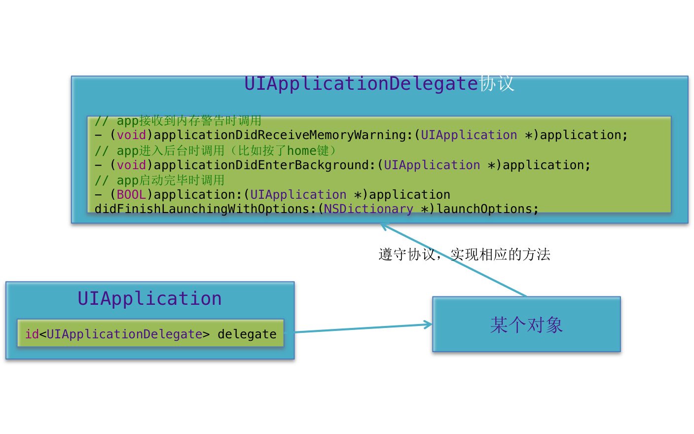
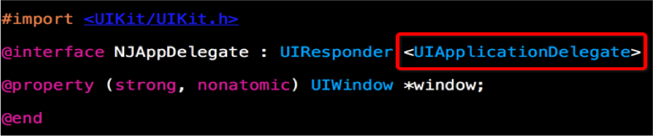

### 一、什么是UIApplication?
<1>每个应用都有自己的UIApplication对象,而且是单例的,由系统创建

<2>通过[UIApplication sharedApplication]可以获得这个单例对象

<3>一个iOS程序启动后创建的第一个对象就是UIApplication对象

1.设置应用程序图标右上角的红色提醒数字

```objc
// 获得单例的UIApplication对象
 UIApplication *app =  [UIApplication sharedApplication];

// 设置应用图标的角标数字
app.applicationIconBadgeNumber = 10;

// 第一次设置时，需要声明并注册一个通知，让用户选择是否接受通知
UIUserNotificationSettings *settings = [UIUserNotificationSettings settingsForTypes:UIUserNotificationTypeBadge categories:nil];

// 注册一个用户的通知
[app registerUserNotificationSettings:settings];
```
2.设置联网指示器的可见性
```objc
// 设置联网状态
UIApplication *app =  [UIApplication sharedApplication];
[app setNetworkActivityIndicatorVisible:YES];
```

3.UIApplication有个功能十分强大的openURL:方法
```objc
// 打电话
UIApplication *app = [UIApplication sharedApplication];
[app openURL:[NSURL URLWithString:@"tel://10086"]];

// 发短信
[app openURL:[NSURL URLWithString:@"sms://10086"]];

// 发邮件
[app openURL:[NSURL URLWithString:@"mailto://12345@qq.com"]];

// 打开一个网页资源
[app openURL:[NSURL URLWithString:@"http://ios.itcast.cn"]];

// 打开其他app程序...
```
4.UIApplication和delegate

<1>所有的移动操作系统都有个致命的缺点：app很容易受到打扰。比如一个来电或者锁屏会导致app进入后台甚至被终止

<2>还有很多其它类似的情况会导致app受到干扰，在app受到干扰时，会产生一些系统事件，这时UIApplication会通知它的delegate对象，让delegate代理来处理这些系统事件

- delegate可处理的事件包括：
        - 应用程序的生命周期事件(如程序启动和关闭)
        - 系统事件(如来电)
        - 内存警告
        - …

<3>设置代理的过程


### 二、UIApplicationDelegate

<1>每次新建完项目，都有个带有“AppDelegate”字眼的类，它就是UIApplication的代理

<2>XXAppDelegate默认已经遵守了UIApplicationDelegate协议，已经是UIApplication的代理


```objc
// @implementation AppDelegate

#warning AppDelegate没有自己创建，系统会默认帮我们创建。

// 处理应用程序的一些生命周期方法
// 内存警告

// 程序启动完成的时候调用
// __func__：表示当前的方法在哪个类里面调用
// -[AppDelegate application:didFinishLaunchingWithOptions:]
- (BOOL)application:(UIApplication *)application didFinishLaunchingWithOptions:(NSDictionary *)launchOptions

// 当应用程序失去焦点的时候调用
- (void)applicationWillResignActive:(UIApplication *)application

// 当应用程序进入后台的时候调用
// 保存一些数据
- (void)applicationDidEnterBackground:(UIApplication *)application

// 当应用程序进入进台的时候调用
- (void)applicationWillEnterForeground:(UIApplication *)application

// 当应用程序获取焦点的时候调用
// 当用户完全获取焦点的时候，才能跟界面交互
- (void)applicationDidBecomeActive:(UIApplication *)application

// 当应用程序关闭的时候调用
- (void)applicationWillTerminate:(UIApplication *)application

// 当程序接收到内存警告的时候调用
- (void)applicationDidReceiveMemoryWarning:(UIApplication *)application

```


