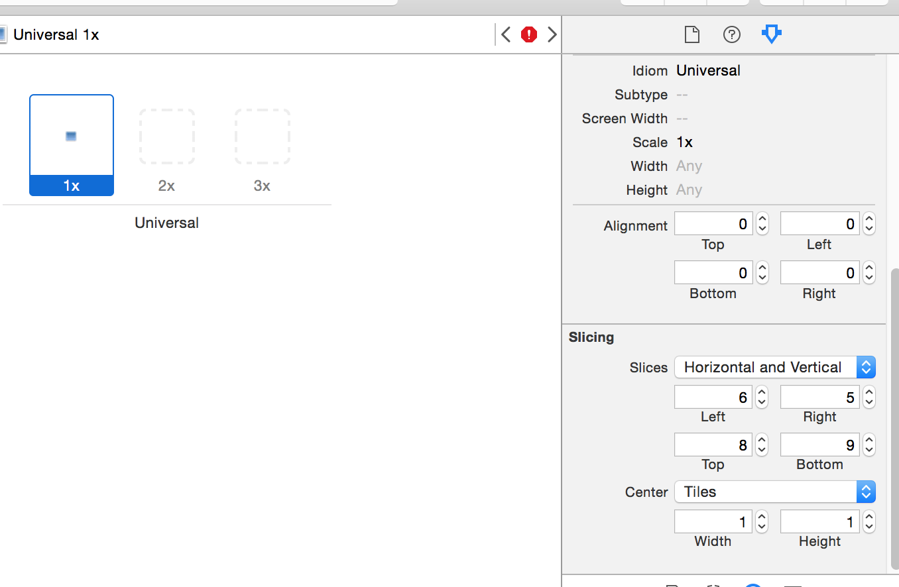

# UIImage

### 一个UIImage对象代表一张图片，一般通过imageNamed:方法就可以通过文件名加载项目中的图片#


```objc
UIImage *image = [UIImage imageNamed:@"lufy"];
```
- **图片的加载方式**
    - **有缓存**
```objc
UIImage *image = [UIImage imageNamed:@"图片名"];
```
        - 使用场合：图片比较小、使用频率较高
        - 建议把需要缓存的图片直接放到Images.xcassets
    - **无缓存**
```objc
NSString *file = [[NSBundle mainBundle] pathForResource:@"图片名" ofType:@"图片的扩展名"];
UIImage *image = [UIImage imageWithContentsOfFile:@"图片文件的全路径"];
    ```
        - 使用场合：图片比较大、使用频率较小
        - 不需要缓存的图片不能放在Images.xcassets
    - 放在Images.xcassets里面的图片，只能通过图片名去加载图片

####图片的拉伸

- iOS5之前

```objc
// right cap == width - leftCapWidth - 1
// bottom cap == height - topCapWidth - 1
// 所以只拉伸中间的1x1区域
- (UIImage *)stretchableImageWithLeftCapWidth:(NSInteger)leftCapWidth topCapHeight:(NSInteger)topCapHeight;
// 一般 leftCapWidth = image.size.width * 0.5 保护一半
// topCapHeight = image.size.height * 0.5
```

- iOS5开始

```objc
- (UIImage *)resizableImageWithCapInsets:(UIEdgeInsets)capInsets;
- (UIImage *)resizableImageWithCapInsets:(UIEdgeInsets)capInsets resizingMode:(UIImageResizingMode)resizingMode;
UIImageResizingMode
// UIImageResizingMode :UIImageResizingModeTile(平铺) UIImageResizingModeStretch(拉伸)
```
- #### Xcode自带拉伸设置


