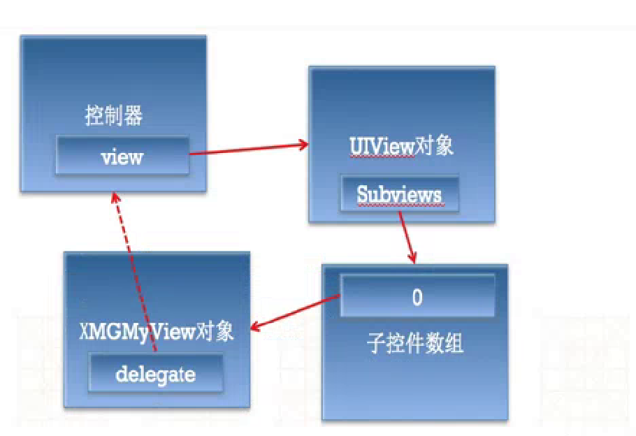

# UIScrollView

## 注意点
1. 如果UIScrollView无法滚动，可能是以下原因：

    ➢ 没有设置contentSize

    ➢ scrollEnabled = NO

    ➢ 没有接收到触摸事件:userInteractionEnabled = NO ...

2. 在UIScrollView显示滚动条的情况下，不要使用
scrollView.subviews[i]去访问子控件，因为数组的索引会因为两个滚动条子控件改变。如果scrollView不是通过storyboard、xib创  建，那么一开始的subviews里面没有子控件。

3. **如果没有滚动条，必要的话，可以使用scrollView.subviews[i]去访问子控件**

4.
ContentOffset :
是内容区域相对于显示区域(UIScrollView的frame)的偏移量
偏移量= 显示区域 - 内容左上角 的 差值
contentInset :
是原来内容的周边增加内边距,contentInset不影响原来的
ContentOffset和contentSize的计算

5. ### `(1)设置代理方法`

```objc
@interface ViewController ()  <UIScrollViewDelegate>
// 1. 类扩展中设置要遵循的代理
// 注意：自定义类不能被包含.m文件，所以代理放.h中
@end
```

### `(2)设置遵循代理的对象`
```objc
@implementation ViewController
- (void)viewDidLoad {
    [super viewDidLoad];
    scrollView.delegate = self;  //
// @property (nonatomic, assign) id <UICollectionViewDelegate> delegate;
// delegate为弱引用，所以右边的赋值对象要为强引用（否则对象很快被销毁）,一般让控制器做代理.
}
@end
```
### `delegate为弱引用的原因`


#### 代理使用的一般规律
- 作用：用来监听控件的某些行为
- 代理：是控制器对象
- 代理：是id类型，并且是弱指针
- 代理协议的格式：控件类名Delegate，比如UIScrollViewDelegate、UITextFieldDelegate
- 代理方法：方法名一般是控件名开头，比如UIScrollView的代理方法一般以scrollView开头

#### 如何监听控件的行为
- 通过addTarget:
    - 只有继承自UIControl的控件，才有这个功能
    - UIControlEventTouchUpInside : 点击事件（UIButton）
    - UIControlEventValueChanged : 值改变事件 （UISwitch、UISegmentControl、UISlider）
    - UIControlEventEditingChanged : 文字改变事件（UITextField）
- 通过delegate
    - 只有拥有delegate属性的控件，才有这个功能


### `(3)实现代理的方法`
#### < UIScrollViewDelegate >  代理方法
```objc
// 只要scrollView在滚动，就会调用这个方法（监听scrollView的滚动）
- (void)scrollViewDidScroll:(UIScrollView *)scrollView

// 用户即将开始拖拽scrollView，就会调用这个方法调用这个方法
- (void)scrollViewWillBeginDragging:(UIScrollView *)scrollView�w
// 用户即将停止拖拽scrollView，就会调用这个方法
- (void)scrollViewWillEndDragging:(UIScrollView *)scrollView withVelocity:(CGPoint)velocity targetContentOffset:(inout CGPoint *)targetContentOffset

// 用户已经停止拖拽scrollView，就会调用这个方法
- (void)scrollViewDidEndDragging:(UIScrollView *)scrollView willDecelerate:(BOOL)decelerate
{
    if (decelerate == NO) {
        NSLog(@"scrollView停止滚动，完全静止");
    } else {
        NSLog(@"用户停止拖拽，但是scrollView由于惯性，会继续滚动，并且减速");
    }
}

// scrollView已经停止减速，就会调用这个方法（停止滚动）
- (void)scrollViewDidEndDecelerating:(UIScrollView *)scrollView
{
    NSLog(@"scrollView减速完毕，停止滚动，完全静止");
}
```
### `代理的图像缩放方法`
```objc
- (UIView *)viewForZoomingInScrollView:(UIScrollView *)scrollView;     // 返回一个要被缩放的对象 if delegate returns nil, nothing happens

- (void)scrollViewWillBeginZooming:(UIScrollView *)scrollView withView:(UIView *)view  // called before the scroll view begins zooming its content

- (void)scrollViewDidEndZooming:(UIScrollView *)scrollView withView:(UIView *)view atScale:(CGFloat)scale; // scale between minimum and maximum. called after any 'bounce' animations

- (BOOL)scrollViewShouldScrollToTop:(UIScrollView *)scrollView;   // return a yes if you want to scroll to the top. if not defined, assumes YES

- (void)scrollViewDidScrollToTop:(UIScrollView *)scrollView;
```
###范例
```objc
@property (weak, nonatomic) IBOutlet UIScrollView *scrollView;

- (void)viewDidLoad   {
[super viewDidLoad];

// 设置滚动范围 一般设置为内容控件的size
self.scrollView.contentSize = imageView.frame.size;

// 设置内边距（在原来内容的周边，增加内边距）
// contentInset 不会影响 contentOffset
self.scrollView.contentInset = UIEdgeInsetsMake(10, 20, 40, 80);
} //viewDidLoad 结束

/**
 *  点击了控制器的view，就会自动调用这个方法
 */
- (void)touchesBegan:(NSSet *)touches withEvent:(UIEvent *)event
{
# ContentOffset == UIScrollView的左上角 - contentSize的左上角
//    [self.scrollView setContentOffset:CGPointMake(-100, -200) animated:YES];
//    [self.scrollView setContentOffset:CGPointMake(350, 350) animated:YES];
}


- (void)test {
    // 是否有弹簧效果 (范围超过contentSize时的弹簧效果)
    //    self.scrollView.bounces = NO;

    // 不管有没有contentSize，都能拥有弹簧效果(一般适用于下拉刷新功能，上拉刷新)
    // 主要用在bounces=YES且没有设置contentSize时
    self.scrollView.alwaysBounceVertical = YES;
    self.scrollView.alwaysBounceHorizontal = YES;

    // 是否要显示滚动条
    self.scrollView.showsHorizontalScrollIndicator = NO;
    self.scrollView.showsVerticalScrollIndicator = NO;
    self.scrollView.indicatorStyle = UIScrollViewIndicatorStyleDefault;

    // 设置滚动条的显示风格
    self.scrollView.indicatorStyle = UIScrollViewIndicatorStyleWhite;

    [[self.scrollView.subviews firstObject] removeFromSuperview]; //
}

- (IBAction)top {
     [UIView animateWithDuration:1.0 animations:^{
     //CGPoint offset = self.scrollView.contentOffset;
     //offset.y = 0;
     //self.scrollView.contentOffset = offset;

     self.scrollView.contentOffset = CGPointMake(self.scrollView.contentOffset.x, 0);
     }];

    // [self.scrollView setContentOffset:CGPointMake(self.scrollView.contentOffset.x, 0) animated:YES];
}

- (IBAction)bottom {
    CGFloat offsetY = self.scrollView.contentSize.height - self.scrollView.frame.size.height;
    CGFloat offsetX = self.scrollView.contentOffset.x;
    CGPoint offset = CGPointMake(offsetX, offsetY);
    [self.scrollView setContentOffset:offset animated:YES];
}

- (IBAction)left {
    [self.scrollView setContentOffset:CGPointMake(0, self.scrollView.contentOffset.y) animated:YES];
}

- (IBAction)right {
    CGFloat offsetX = self.scrollView.contentSize.width - self.scrollView.frame.size.width;
    CGFloat offsetY = self.scrollView.contentOffset.y;
    CGPoint offset = CGPointMake(offsetX, offsetY);
    [self.scrollView setContentOffset:offset animated:YES];
}

- (IBAction)rightTop {
    CGFloat offsetX = self.scrollView.contentSize.width - self.scrollView.frame.size.width;
    CGFloat offsetY = 0;
    CGPoint offset = CGPointMake(offsetX, offsetY);
    [self.scrollView setContentOffset:offset animated:YES];
}

- (IBAction)leftBottom {
    CGFloat offsetX = 0;
    CGFloat offsetY = self.scrollView.contentSize.height - self.scrollView.frame.size.height;
    CGPoint offset = CGPointMake(offsetX, offsetY);
    [self.scrollView setContentOffset:offset animated:YES];
}
```


