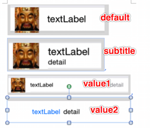

##创建UITableView
- (instancetype)initWithFrame:(CGRect)frame style:(UITableViewStyle)style;
- UITableViewStyle
    - UITableViewStylePlain //
    - UITableViewStyleGrouped // 分组

## 如何让tableView展示数据
- 设置数据源对象

```objc
self.tableView.dataSource = self;
```

- 数据源对象要遵守协议

```objc
@interface ViewController () <UITableViewDataSource>

@end
```

- 实现数据源方法

```objc
// 多少组数据
- (NSInteger)numberOfSectionsInTableView:(UITableView *)tableView;

// 每一组有多少行数据
- (NSInteger)tableView:(UITableView *)tableView numberOfRowsInSection:(NSInteger)section;

// 每一行显示什么内容
- (UITableViewCell *)tableView:(UITableView *)tableView cellForRowAtIndexPath:(NSIndexPath *)indexPath;

// 设置每一组的头部（1）
- (NSString *)tableView:(UITableView *)tableView titleForHeaderInSection:(NSInteger)section;

// 设置每一组的头部（2）
//- (UIView *)tableView:(UITableView *)tableView viewForHeaderInSection:(NSInteger)section

// 设置每一组的尾部（1）
- (NSString *)tableView:(UITableView *)tableView titleForFooterInSection:(NSInteger)section

// 设置每一组的尾部（2）
- (UIView *)tableView:(UITableView *)tableView viewForFooterInSection:(NSInteger)section

// 每一组的头部高度
- (CGFloat)tableView:(UITableView *)tableView heightForHeaderInSection:(NSInteger)section

// 每一组的尾部高度
- (CGFloat)tableView:(UITableView *)tableView heightForRowAtIndexPath:(NSIndexPath *)indexPath

// 设置每一行的高度
- (CGFloat)tableView:(UITableView *)tableView heightForRowAtIndexPath:(NSIndexPath *)indexPath

// 当选中一行的时候调用（点击）
- (void)tableView:(UITableView *)tableView didSelectRowAtIndexPath:(NSIndexPath *)indexPath

// 当取消选中一行的时候调用
- (void)tableView:(UITableView *)tableView didDeselectRowAtIndexPath:(NSIndexPath *)indexPath


// 返回每一组的索引标题（数组中放的是字符串）
- (NSArray *)sectionIndexTitlesForTableView:(UITableView *)tableView
{
//    NSMutableArray *titles = [NSMutableArray array];
//    for (MJCarGroup *group in self.carGroups) {
//        [titles addObject:group.title];
//    }
//    return titles;
    // 数组的KVC 返回一个数组
    return [self.carGroups valueForKeyPath:@"title"];
}
```

## tableView的常见设置
```objc
// 设置每一行cell的高度
self.tableView.rowHeight = 100;

// 设置每一组头部的高度
self.tableView.sectionHeaderHeight = 50;

// 设置每一组尾部的高度
self.tableView.sectionFooterHeight = 50;

// 设置分割线颜色
self.tableView.separatorColor = [UIColor redColor];
// 设置分割线样式
self.tableView.separatorStyle = UITableViewCellSeparatorStyleNone;
// 设置表头控件
self.tableView.tableHeaderView = [[UISwitch alloc] init];
// 设置表尾控件
self.tableView.tableFooterView = [UIButton buttonWithType:UIButtonTypeContactAdd];

// 设置右边索引文字的颜色
self.tableView.sectionIndexColor = [UIColor redColor];
// 设置右边索引文字的背景色
self.tableView.sectionIndexBackgroundColor = [UIColor blackColor];

```

# tableViewCell的常见设置

```objc
// 带style的初始化
initWithStyle:(UITableViewCellStyle)style reuseIdentifier:(NSString *)reuseIdentifier
    UITableViewCellStyleDefault,
    UITableViewCellStyleValue1,
    UITableViewCellStyleValue2,
    UITableViewCellStyleSubtitle
    效果如下图所示
```


```objc
//设置右边的指示样式accessoryView的优先级> accessoryType
cell.accessoryType = UITableViewCellAccessoryDisclosureIndicator;
/*
UITableViewCellAccessoryNone,//  没有
UITableViewCellAccessoryDisclosureIndicator,// 向右的箭头
UITableViewCellAccessoryDetailDisclosureButton,// info button + 向右的箭头
UITableViewCellAccessoryCheckmark,// 对号选中
UITableViewCellAccessoryDetailButton,// info button

*/

//设置右边的指示控件accessoryView的优先级 >accessoryType
cell.accessoryView = [[UISwitch alloc] init];

// 设置cell的选中样式
cell.selectionStyle = UITableViewCellSelectionStyleNone;
// backgroundView优先级 > backgroundColor

// 设置背景色
cell.backgroundColor = [UIColor redColor];

// 设置背景view
UIView *bg = [[UIView alloc] init];
bg.backgroundColor = [UIColor blueColor];
cell.backgroundView = bg;

// 设置选中的背景view
UIView *selectedBg = [[UIView alloc] init];
selectedBg.backgroundColor = [UIColor purpleColor];
cell.selectedBackgroundView = selectedBg;
```

### cell的循环利用
- 传统的写法

```objc
/**
 *  每当有一个cell要进入视野范围内，就会调用一次
 */
- (UITableViewCell *)tableView:(UITableView *)tableView cellForRowAtIndexPath:(NSIndexPath *)indexPath
{
    // 声明为static变量
    static NSString *ID = @"wine";

    // 1.先去缓存池中查找可循环利用的cell
    UITableViewCell *cell = [tableView dequeueReusableCellWithIdentifier:ID];

    // 2.如果缓存池中没有可循环利用的cell
    if (!cell) {
        cell = [[UITableViewCell alloc] initWithStyle:UITableViewCellStyleDefault reuseIdentifier:ID];
    }

    // 3.设置数据
    cell.textLabel.text = [NSString stringWithFormat:@"%zd行的数据", indexPath.row];

    return cell;
}
```

- 新的写法（注册cell）
    - 查找cell顺序：先去缓存池中根据标示查找cell，找不到     了再去查看有没有注册,如果注册了用注册的类型创建，如果    没有注册去storyboard中查找有没有标示的cell。

```objc
NSString *ID = @"wine";

- (void)viewDidLoad {
    [super viewDidLoad];

    // 注册某个重用标识 对应的 Cell类型
    [self.tableView registerClass:[UITableViewCell class] forCellReuseIdentifier:ID];
}

- (UITableViewCell *)tableView:(UITableView *)tableView cellForRowAtIndexPath:(NSIndexPath *)indexPath
{
    // 1.先去缓存池中查找可循环利用的cell
    UITableViewCell *cell = [tableView dequeueReusableCellWithIdentifier:ID];

    // 2.设置数据
    cell.textLabel.text = [NSString stringWithFormat:@"%zd行的数据", indexPath.row];

    return cell;
}
```
## `补充`
```objc

/**
 *  隐藏状态栏
 */
- (BOOL)prefersStatusBarHidden
{
    return YES;
}
```
