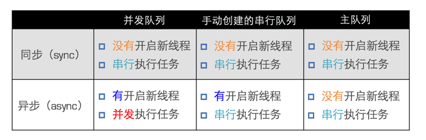

# NSThread


### 创建线程的方法

```objc
1. [NSThread detachNewThreadSelector:SEL toTarget:id withObject:id];

2. [self performSelectorInBackground:SEL withObject:id];

3. NSThread *thread = [[NSThread alloc] initWithTarget:self selector:SEL object:nil];

# 1.2.创建后自动启动  3需要自己start线程
```

### 主线程相关用法

```objc
+ (NSThread *)mainThread; // 获得主线程
- (BOOL)isMainThread; // 是否为主线程
+ (BOOL)isMainThread; // 是否为主线程

```
### 获得当前线程
```objc
NSThread *current = [NSThread currentThread];
```
### 线程状态
- 新建(New) 需要start才能进入就绪
- 就绪(Runnable)
- 运行(Running)
- 阻塞(Blocked)
- 死亡(Dead)

****
### 控制线程状态
```objc
1. 启动线程
- (void)start; 
// 进入就绪状态 -> 运行状态。当线程任务执行完毕，自动进入死亡状态

2. 阻塞（暂停）线程
+ (void)sleepUntilDate:(NSDate *)date;
+ (void)sleepForTimeInterval:(NSTimeInterval)ti;
// 进入阻塞状态

3. 强制停止线程
+ (void)exit;
// 进入死亡状态

# 注意：一旦线程停止（死亡）了，就不能再次开启任务
```
### 安全隐患解决 – 互斥锁

```objc
# 互斥锁使用格式
@synchronized(锁对象) { // 需要锁定的代码  }
# 注意：锁定1份代码只用1把锁，用多把锁是无效的
```
#### 互斥锁的优缺点
- 优点：能有效防止因多线程抢夺资源造成的数据安全问题
- 缺点：需要消耗大量的CPU资源

#### nonatomic和atomic对比
- atomic：原子属性，为setter方法加锁（默认就是atomic）,线程安全，需要消耗大量的资源
- nonatomic：非原子属性，不会为setter方法加锁
,非线程安全，适合内存小的移动设备

#### 互斥锁和自旋锁不同点
- 如果是互斥锁, 假如现在被锁住了, 那么后面来得线程就会进入”休眠”状态, 直到解锁之后, 又会唤醒线程继续执行
- 如果是自旋锁, 假如现在被锁住了, 那么后面来得线程不会进入休眠状态, 会一直傻傻的等待, 直到解锁之后立刻执行
自旋锁更适合做一些较短的操作

#### iOS开发的建议
- 所有属性都声明为nonatomic
- 尽量避免多线程抢夺同一块资源
- 尽量将加锁、资源抢夺的业务逻辑交给服务器端处理，减小移动客户端的压力

#### 线程间通信
```objc
# 线程间通信常用方法
- (void)performSelectorOnMainThread:(SEL)aSelector withObject:(id)arg waitUntilDone:(BOOL)wait;
- (void)performSelector:(SEL)aSelector onThread:(NSThread *)thr withObject:(id)arg waitUntilDone:(BOOL)wait;
```

#### 线程间通信方式 – 利用NSPort

#GCD
- 全称是Grand Central Dispatch，可译为“牛逼的中枢调度器”
- 纯C语言，提供了非常多强大的函数

#### GCD的优势
- GCD是苹果公司为多核的并行运算提出的解决方案
- GCD会自动管理线程的生命周期（创建线程、调度任务、销毁线程）

#### GCD中有2个核心概念
- 任务：执行什么操作
- 队列：用来存放任务

#### GCD的使用就2个步骤
- 定制任务
- 将任务添加到队列中
    - GCD会自动将队列中的任务取出，放到对应的线程中执行
    - 任务的取出遵循队列的FIFO原则：先进先出，后进后出
    
#### GCD执行任务

- 用同步的方式执行任务
    - 同步：只能在当前线程中执行任务，不具备开启新线程的能力
```objc
dispatch_sync(dispatch_queue_t queue, dispatch_block_t block);
// queue：队列
// block：任务
```

- 用异步的方式执行任务
    - 异步：可以在新的线程中执行任务，具备开启新线程的能力
```objc
dispatch_async(dispatch_queue_t queue, dispatch_block_t block);
```
- GCD中还有个用来执行任务的函数

```objc
dispatch_barrier_async(dispatch_queue_t queue, dispatch_block_t block);
# 在前面的任务执行结束后它才执行，而且它后面的任务等它执行完成之后才会执行
# 这个queue不能是全局的并发队列

    dispatch_queue_t barrierQueue = dispatch_queue_create("com.hackemist.SDWebImageDownloaderBarrierQueue", DISPATCH_QUEUE_CONCURRENT);
    
    dispatch_async(barrierQueue, ^{
        NSLog(@"--------------");
        NSLog(@"11---  %@",[NSThread currentThread]);
    });
    // dispatch_barrier_async和dispatch_barrier_sync
    都能保证执行顺序，后者的栅栏block在主线程执行
    dispatch_barrier_async(barrierQueue, ^{
        NSLog(@"--------------");
        NSLog(@"22---  %@",[NSThread currentThread]);
    });
//    dispatch_barrier_sync(barrierQueue, ^{
//        NSLog(@"--------------");
//        NSLog(@"22---  %@",[NSThread currentThread]);
//    });
    
    
    dispatch_async(barrierQueue, ^{
        NSLog(@"--------------");
        NSLog(@"33---  %@",[NSThread currentThread]);
        
    });
    
```

#### GCD的队列可以分为2大类型
- 并发队列（Concurrent Dispatch Queue）
    - 可以让多个任务并发（同时）执行（自动开启多个线程同时执行任务）
    - 并发功能只有在异步（dispatch_async）函数下才有效
- 串行队列（Serial Dispatch Queue）
    - 让任务一个接着一个地执行（一个任务执行完毕后，再执行下一个任务）

#### 同步和异步主要影响：能不能开启新的线程
- 同步：只是在当前线程中执行任务，不具备开启新线程的能力
- 异步：可以在新的线程中执行任务，具备开启新线程的能力

#### 并发和串行主要影响：任务的执行方式
- 并发：允许多个任务并发（同时）执行
- 串行：一个任务执行完毕后，再执行下一个任务

#### 并发队列
```objc
// 队列名称 队列的类型
dispatch_queue_create(const char *label,dispatch_queue_attr_t attr); 

# eg:创建并发队列
dispatch_queue_t queue = dispatch_queue_create("com.520it.queue", DISPATCH_QUEUE_CONCURRENT);

# 获得全局并发队列
// 参数一般直接传(0,0)
dispatch_queue_t queue = dispatch_get_global_queue(DISPATCH_QUEUE_PRIORITY_DEFAULT, 0); 
```
##### 全局并发队列的优先级
```objc
#define DISPATCH_QUEUE_PRIORITY_HIGH 2 // 高
#define DISPATCH_QUEUE_PRIORITY_DEFAULT 0 // 默认（中）
#define DISPATCH_QUEUE_PRIORITY_LOW (-2) // 低
#define DISPATCH_QUEUE_PRIORITY_BACKGROUND INT16_MIN // 后台
```

#### 串行队列

##### GCD中获得串行有2种途径
- 使用dispatch_queue_create函数创建串行队列

```objc
// 创建串行队列（队列类型传递NULL或者DISPATCH_QUEUE_SERIAL）
dispatch_queue_t queue = dispatch_queue_create("com.520it.queue", NULL); 
```

- 使用主队列（跟主线程相关联的队列）

```objc
# 主队列是GCD自带的一种特殊的串行队列放在主队列中的任务，都会放到主线程中执行
dispatch_queue_t queue = dispatch_get_main_queue();
```

#### 各种队列的执行效果

<font color=red>注意:使用sync函数往当前串行队列中添加任务，会卡住当前的串行队列</font>

#### 线程间通信示例

```objc
// 从子线程回到主线程
dispatch_async(
dispatch_get_global_queue(DISPATCH_QUEUE_PRIORITY_DEFAULT, 0), ^{
    // 执行耗时的异步操作...
      dispatch_async(dispatch_get_main_queue(), ^{
        // 回到主线程，执行UI刷新操作
        });
});

```

#### 延时执行
- 调用NSObject的方法
```objc
[self performSelector:@selector(run) withObject:nil afterDelay:2.0];
// 2秒后再调用self的run方法
```
- 使用GCD函数
```objc
dispatch_after(dispatch_time(DISPATCH_TIME_NOW, (int64_t)(2.0 * NSEC_PER_SEC)), dispatch_get_main_queue(), ^{
    // 2秒后执行这里的代码...
});
```
- 使用NSTimer
```objc
[NSTimer scheduledTimerWithTimeInterval:2.0 target:self selector:@selector(test) userInfo:nil repeats:NO];
```

#### 一次性代码
```objc
// 使用dispatch_once函数能保证某段代码在程序运行过程中只被执行1次
static dispatch_once_t onceToken;
dispatch_once(&onceToken, ^{
    // 只执行1次的代码(这里面默认是线程安全的)
});
```
#### 快速迭代
```objc
// 使用dispatch_apply函数能进行快速迭代遍历
dispatch_apply(10, dispatch_get_global_queue(0, 0), ^(size_t index){
    // 执行10次代码，index顺序不确定
});
```
### 队列组
若有此需求：分别异步执行2个耗时的操作,等2个异步操作都执行完毕后，再回到主线程执行操作

```objc
dispatch_group_t group =  dispatch_group_create();
dispatch_group_async(group, dispatch_get_global_queue(DISPATCH_QUEUE_PRIORITY_DEFAULT, 0), ^{
    // 执行1个耗时的异步操作
});
dispatch_group_async(group, dispatch_get_global_queue(DISPATCH_QUEUE_PRIORITY_DEFAULT, 0), ^{
    // 执行1个耗时的异步操作
});
dispatch_group_notify(group, dispatch_get_main_queue(), ^{
    // 等前面的异步操作都执行完毕后，回到主线程...
});
```

### 后台运行
GCD的另一个用处是可以让程序在后台较长久的运行。

在没有使用GCD时，当app被按home键退出后，app仅有最多5秒钟的时候做一些保存或清理资源的工作。但是在使用GCD后，app最多有10分钟的时间在后台长久运行。这个时间可以用来做清理本地缓存，发送统计数据等工作。

让程序在后台长久运行的示例代码如下：
```objc
// AppDelegate.h文件 
@property (assign, nonatomic) UIBackgroundTaskIdentifier backgroundUpdateTask; 
 
// AppDelegate.m文件 
- (void)applicationDidEnterBackground:(UIApplication *)application 
{ 
    [self beingBackgroundUpdateTask]; 
    // 在这里加上你需要长久运行的代码 
    [self endBackgroundUpdateTask]; 
} 
 
- (void)beingBackgroundUpdateTask 
{ 
    self.backgroundUpdateTask = [[UIApplication sharedApplication] beginBackgroundTaskWithExpirationHandler:^{ 
        [self endBackgroundUpdateTask]; 
    }]; 
} 
 
- (void)endBackgroundUpdateTask 
{ 
    [[UIApplication sharedApplication] endBackgroundTask: self.backgroundUpdateTask]; 
    self.backgroundUpdateTask = UIBackgroundTaskInvalid; 
} 
```


