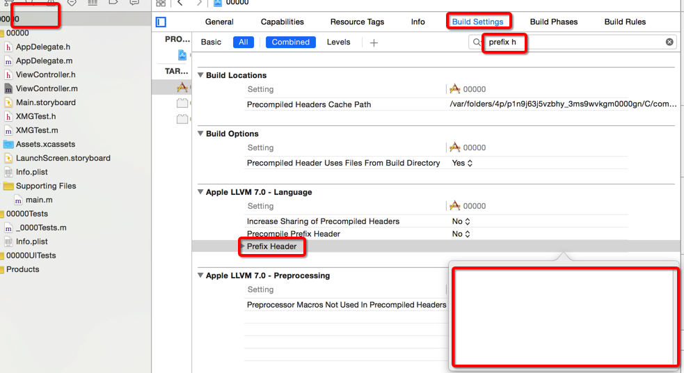

# 常用宏定义

- ##### 1

```objc

```

- ##### 根据版本是debug还是release禁用NSLog

```objc
/** 日志输出 */
#ifdef DEBUG // 开发
#define XMGLog(...) NSLog(__VA_ARGS__)
#else // 发布
#define XMGLog(...)
#endif
```
- ##### 判断是否是OC语言
```objc
#ifdef __OBJC__
#endif
```
- ##### 判断是ARC还是MRC
```objc
#if __has_feature(objc_arc)
// 如果是ARC什么都不添加
#else
#endif
```

- ##### 判断iOS版本和设备
```objc
// 是否大于iOS7
#define IOS7 ([[[UIDevice currentDevice].systemVersion doubleValue] >= 7.0])
```
```objc
// 如果定义此宏，说明iOS SDK大，9.0
#ifndef __IPHONE_9_0
#warning "This project uses features only available in iOS SDK 4.0 and later."
#endif
```
```objc
// 设备型号iPhone5
#define kScreenIphone5 (([[UIScreen mainScreen] bounds].size.height) >= 568)
```
- ##### 硬件信息的获取


- pch文件使用前要包含路径
    - 从工程目录下开始所以可省略为 00000/PrefixHeader.pch
    - 还有个$(SRCROOT)/pchFile.pch什么的...




- pch常用条件编译

```objc


```objc
#ifndef __IPHONE_4_0
#warning "This project uses features only available in iOS SDK 4.0 and later."
#endif

#ifdef __OBJC__
  #import <UIKit/UIKit.h>
  #import <Foundation/Foundation.h>
#endif
```