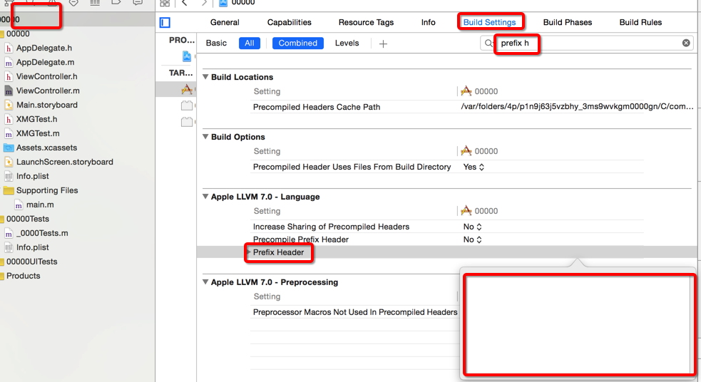

- pch文件使用前要包含路径
    - 从工程目录下开始
    - $(SRC)00000/PrefixHeader.pch



- pch常用条件编译

```objc
#ifdef __OBJC__
  
#endif


/** 日志输出 */
#ifdef DEBUG // 开发
#define XMGLog(...) NSLog(__VA_ARGS__)
#else // 发布
#define XMGLog(...)
#endif

```

- 