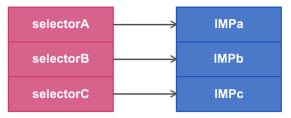
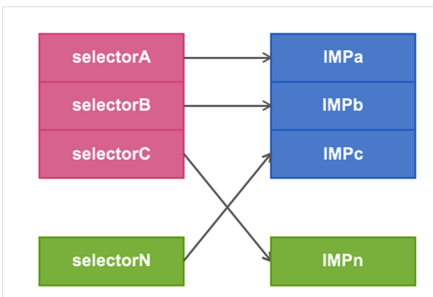

ios中我们就用**Method Swizzling(方法混淆)**来实现hook，为什么说是内部钩子呢，因为需要在工程里实现，我改天会分享外部的。

先了解一下SEL和IMP的概念，

SEL可以理解为函数名的意思，我们常用的@selector()就是通过字符串获得SEL

IMP可以理解成函数指针的意思，是能正确读取到函数的内容
一般是这样的：盗个图



我们要做的就是把链接线解开，然后连到我们自定义的函数IMP上，如果有需要的话，我们再连回原来的IMP上

就是这样的：



如果在执行完IMPn后还想继续调用IMPc的话，只需要在IMPn中调用selectorN就行了。

具体怎么做呢：

```objc
Method origMethod = class_getInstanceMethod(class, origSelector);  //获取SEL的Method

```
Method是一个结构体，我们想要的IMP就在里面，看看结构
```objc
struct objc_method {
    SEL method_name                     OBJC2_UNAVAILABLE;
    char *method_types                  OBJC2_UNAVAILABLE;
    IMP method_imp                      OBJC2_UNAVAILABLE;
}
```
```
IMP origIMP = method_getImplementation(origMethod);  //获取Method中的IMP
```
ok，IMP获取到了，连接SEL到别的IMP呢
```objc
BOOL class_addMethod(Class cls, SEL name, IMP imp, const char *types);  //先增加新方法名SEL+原来的IMP
IMP method_setImplementation(Method m, IMP imp);//然后将原来的method(SEL)重新分配新的IMP

```

```objc
void method_exchangeImplementations(Method m1, Method m2) //或者可以使用method的交换方法

```

实战，假设我们想知道app跳转都传送了什么值（如应用调用QQ分享什么的），那么我们可以勾取UIApplication的OpenUrl方法
```objc
#import "KHookObjectWrapper.h"
#import "UIKit/UIKit.h"
#import <objc/objc.h>
#import <objc/runtime.h>
 
@implementation KHookObjectWrapper
 
+ (void)setup
{
    //openURL
    Method m = class_getInstanceMethod([UIApplication class], @selector(openURL:));
    class_addMethod([UIApplication class], @selector(hook_openURL:), method_getImplementation(m), method_getTypeEncoding(m));
    method_setImplementation(m, class_getMethodImplementation([self class], @selector(hook_openURL:)));
}
 
- (BOOL)hook_openURL:(NSURL *)url
{
    NSLog(@"hook_openURL:%@", [url absoluteString]);
    return [self hook_openURL:url];
}

```

使用method的交换方法实现：
```objc
#import "KHookObjectWrapper.h"
#import "UIKit/UIKit.h"
#import <objc/objc.h>
#import <objc/runtime.h>
 
@implementation KHookObjectWrapper
 
+ (void)setup
{
    //openURL
    Method m = class_getInstanceMethod([UIApplication class], @selector(openURL:));
    Method m2 = class_getInstanceMethod([self class], @selector(hook_openURL:));
     
    class_addMethod([UIApplication class], @selector(hook_openURL:), method_getImplementation(m), method_getTypeEncoding(m)); //为什么要有这句的，因为UIApplication没有hook_openURL方法会奔溃，大家觉得可以讲self的hook_openURL改名成openURL，大家可以试试，也是不行的
     
    method_exchangeImplementations(m, m2);
}
 
- (BOOL)hook_openURL:(NSURL *)url
{
    NSLog(@"hook_openURL:%@", [url absoluteString]);
    return [self hook_openURL:url];
}
 
@end
```

另外再加一点，假如你只是想重写类的某些方法，分类也是不错的选择，分类一旦加入工程，不需要包含头文件有会生效，所以请慎重使用
```objc
@implementation UIApplication (test)
 
- (BOOL)openURL:(NSURL*)url {
    NSLog(@"!!!!!%@", [url absoluteString]);
    return YES;
}
 
@end
```
当然你没办法重新在掉回原来的IMP了！